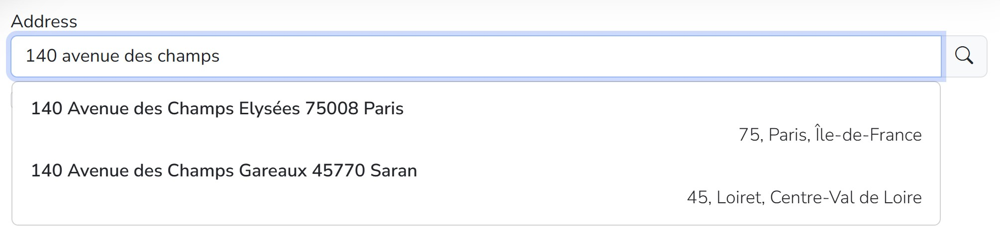

[](https://opensource.org/licenses/MIT)
[](https://www.npmjs.com/package/@actionlogementservices/aurelia-plugin-ui)

# `@actionlogementservices/aurelia-plugin-ui`

An Aurelia plugin that provides **custom elements** and **ui services** for **aurelia v1** applications on top of **[Bootstrap 5](https://getbootstrap.com/)**.

## Description

This plugin provides 3 services:

- `DialogService`: integrates [Bootstrap modal dialog](https://getbootstrap.com/docs/5.3/components/modal/#modal-components) in your application with an aurelia ViewModel/View approach.
- `ToastService`: integrates [Bootstrap toasts](https://getbootstrap.com/docs/5.3/components/toasts/#overview) in your application.
- `LockService`: implements a logical screen lock to prevent user from interacting with the page.

And several custom elements :

- `simple-select`, `filterable-select`, `badges-select`: custom elements that provides selection based on memory loaded client datasource.
- `auto-complete`, `badges-auto-complete`, `address-auto-complete`: custom elements that provides selection based on 'on-the-fly' requests to a server datasource.
- `input-datepicker`: custom element that integrates the [vanilla-js datepicker](https://mymth.github.io/vanillajs-datepicker/#/) with Bootstrap style.
- `simple-table`: custom element that implements a bootstrap style table with in-memory sorting and selection.

## Installation

1. **Ensure** your **aurelia v1** application is using **Bootstrap 5** and **Bootstrap icons 1**.

1. **Install** the plugin:

   ```node
   npm install @actionlogementservices/aurelia-plugin-ui
   ```

1. **Register** the plugin in aurelia:

   ```javascript
   // in your main.js or main.ts
   export function configure(aurelia) {
     aurelia.use
       .standardConfiguration()
       .plugin(PLATFORM.moduleName('@actionlogementservices/aurelia-plugin-ui'))
   ```

## Usage

### `DialogService`

Display modal dialog with Bootstrap style.

- Inject the [`DialogService`](./doc/src-core-dialog-service_dialog-service.md) in your viewmodel and use the `open` method to open the dialog.
- Create a view and a viewmodel for your modal dialog.
- Inject the [`DialogController`](./doc/src-core-dialog-service_dialog-controller.md) in the modal viewmodel to retrieve input parameters and use
  - the `ok` method of the controller to pass output parameters to the caller and close the modal.
  - the `cancel` method of the controller to close the modal without passing output parameters.
- In the caller, retrieve asynchronously the output parameters from the result of the `open` call : see [`DialogResult`](./doc/src-core-dialog-service_dialog-result.md). If the modal was cancelled the property `wadCancelled` is true.

  ```javascript
  // the caller code, example.js
  import { inject } from 'aurelia-framework';
  import { DialogService } from '@actionlogementservices/aurelia-plugin-ui';
  import { ExampleDialog } from './dialogs/example-dialog';

  @inject(DialogService)
  export class Example {
    /** @param {DialogService} dialog */
    constructor(dialog) {
      this._dialog = dialog;
    }
    ...
    openExampleDialog()
      const { wasCancelled, output } = await this._dialog.open({
        viewModel: ExampleDialog,
        model: { inParam1: 1000 },
        locked: true
      });
      const result = wasCancelled ? undefined : output.outParam1;
    }
  ```

  ```javascript
  // the modal code, example-dialog.js
  import { inject } from 'aurelia-framework';
  import { DialogController } from '@actionlogementservices/aurelia-plugin-ui';

  @inject(DialogController)
  export class ExampleDialog {
    /** @type {Number} */
    input;
    /**
    * @param {DialogController} controller
    */
    constructor(controller) {
      this._controller = controller;
    }
    // the modal code, example-dialog.js
    activate({ inParam1 }) {
      this.inParam1 = inParam1;
    }
    ...
    confirm() {
      this._controller.ok({ outParam2: this.inParam1 * 2 });
    }
    cancel() {
      this._controller.cancel();
    }
  ```

  ```html
  // the modal html, example-dialog.html
  <template>
    <div class="modal-dialog">
      <div class="modal-content">
        <div class="modal-header">
          <h5 class="modal-title">Compute</h5>
          <button
            type="button"
            class="btn-close"
            data-bs-dismiss="modal"
            aria-label="Close"
            click.trigger="cancel()"></button>
        </div>
        <div class="modal-body">...</div>
        <div class="modal-footer">
          <button class="btn btn-primary" click.trigger="confirm()">Oui</button>
          <button class="btn btn-secondary" click.trigger="cancel()">Non</button>
        </div>
      </div>
    </div>
  </template>
  ```

### `ToastService`

Display toasts with Bootstrap style.

- Inject the [`ToastService`](./doc/src-core-toast-service_toast-service.md) in your viewmodel and use the `info`, `success`, `warning` or `error` methods to display a transient toast.
- You can specify an optional delay.

  ```javascript
  // the caller code, example.js
  import { inject } from 'aurelia-framework';
  import { ToastService } from '@actionlogementservices/aurelia-plugin-ui';
  import { ExampleDialog } from './dialogs/example-dialog';

  @inject(ToastService)
  export class Example {
    /** @param {ToastService} toast */
    constructor(toast) {
      this._toast = toast;
    }
    ...
    showToast()
      this._toast.info('Hello !');
    }
  ```

### `LockService`

Prevent user interaction with Bootstrap back drop.

- Inject the [`LockService`](./doc/src-core-lock-service_lock-service.md) in your viewmodel and use the `lock` and `unlock` methods to display a transient toast.
- Don't forget to call the `unlock` method even in case of exception.

  ```javascript
  // the caller code, example.js
  import { inject } from 'aurelia-framework';
  import { LockService } from '@actionlogementservices/aurelia-plugin-ui';

  @inject(LockService)
  export class Example {
    /** @param {LockService} lock */
    constructor(lock) {
      this._lock = lock;
    }
    ...
    async lockScreen() {
      this._lock.lock();
      await lenghtyAsyncOperation().finally(() => this._lock.unlock());
    }
  ```

### `simple-select` custom element

**Single selection** dropdown element with databound in-memory datasource, and **customizable dropdown item template**, well adapted for small number of items (typically **less than 50**).


- Prepare a datasource in your viewmodel representing an array of items.
- Use the [`<simple-select>`](./doc/src-elements-select_simple-select.md) element in your view and data bind the `datasource` attribute.
- Data bind the `selected-item` attribute to your viewmodel to retrieve user selection as a single item.

  ```html
  <simple-select
    class="form-select"
    selected-item.bind="selectedItem"
    datasource.bind="itemsList"></simple-select>
  ```

- Specify an optional template for the dropdown item

  ```html
  <simple-select class="form-select" selected-item.bind="selectedItem" datasource.bind="itemsList">
    <template replace-part="itemTemplate">
      <p class="fw-semibold my-1">${item.code}</p>
      <p class="my-1">${item.name}</p>
    </template>
  </simple-select>
  ```

- You can also retrieve user selection with an item property using `selected-value` and `value-key` attributes.

  ```html
  <simple-select
    class="form-select"
    value-key="code"
    selected-value.bind="selectedValue"
    datasource.bind="itemsList"></simple-select>
  ```

- You can specify the optional following attributes :
  | Attribute name | Role | Possible values | Default value |
  |--- |---|--- |---|
  | `value-key` | Property of the item used to differentiate them | Any string representing a property present on the item | `name` |
  | `label-key` | Property of the item used to display them in the dropdown | Any string representing a property present on the item | `description` |
  | `placeholder` | Placeholder in the select when no selection is done | Any string | |
  | `disabled` | Disable the user interaction | `true` or `false` | `false` |
  | `autosize` | Autosize the dropdown width to the parent width rather than the content of the dropdown | `true` or `false` | `true` |
  | `clear-selection-text` | Text displayed in the dropdown to clear the selection | Any string | `Effacer la sélection` |

### `filterable-select` custom element

**Single selection** dropdown element with databound in-memory datasource, **filtered by user input** and **customizable dropdown item template**, well adapted for small number of items (typically **less than 100**).


- Prepare a datasource in your viewmodel representing an array of items.
- Use the [`<filterable-select>`](./doc/src-elements-select_filterable-select.md) element in your view and data bind the `datasource` attribute.
- Data bind the `selected-item` attribute to your viewmodel to retrieve user selection as a single item.

  ```html
  <filterable-select
    class="form-select"
    selected-item.bind="selectedItem"
    datasource.bind="itemsList"></filterable-select>
  ```

- Specify an optional template for the dropdown item

  ```html
  <filterable-select class="form-select" selected-item.bind="selectedItem" datasource.bind="itemsList">
    <template replace-part="itemTemplate">
      <p class="fw-semibold my-1">${item.code}</p>
      <p class="my-1">${item.name}</p>
    </template>
  </filterable-select>
  ```

- You can also retrieve user selection with an item property using `selected-value` and `value-key` attributes.

  ```html
  <filterable-select
    class="form-select"
    value-key="code"
    selected-value.bind="selectedValue"
    datasource.bind="itemsList"></filterable-select>
  ```

- You can specify the optional following attributes :
  | Attribute name | Role | Possible values | Default value |
  |--- |---|--- |---|
  | `value-key` | Property of the item used to differentiate them | Any string representing a property present on the item | `name` |
  | `label-key` | Property of the item used to display them in the dropdown | Any string representing a property present on the item | `description` |
  | `placeholder` | Placeholder in the select when no selection is done | Any string | |
  | `disabled` | Disable the user interaction | `true` or `false` | `false` |
  | `autosize` | Autosize the dropdown width to the parent width rather than the content of the dropdown | `true` or `false` | `true` |
  | `clear-selection-text` | Text displayed in the dropdown to clear the selection | Any string | `Effacer la sélection` |
  | `no-result-text` | Text displayed when user input filters out all items | Any string | `Aucun résultat` |

### `badges-select` custom element

**Multiple selections** dropdown element with databound in-memory datasource, **filtered by user input**, with **badges** representing current selection, and **customizable dropdown item template**, well adapted for small number of items (typically **less than 100**).


- Prepare a datasource in your viewmodel representing an array of items.
- Use the [`<badges-select>`](./doc/src-elements-select_badges-select.md) element in your view and data bind the `datasource` attribute.
- Data bind the `values` attribute to your viewmodel to retrieve user selection as an array os items.

  ```html
  <badges-select
    class="form-select"
    selected-items.bind="selectedItems"
    datasource.bind="itemsList"></badges-select>
  ```

- Specify an optional template for the dropdown item

  ```html
  <badges-select class="form-select" values.bind="selectedItems" datasource.bind="itemsList">
    <template replace-part="itemTemplate">
      <p class="fw-semibold my-1">${item.code}</p>
      <p class="my-1">${item.name}</p>
    </template>
  </badges-select>
  ```

- You can also retrieve user selection with an item property using `selected-value` and `value-key` attributes.

  ```html
  <badges-select
    class="form-select"
    value-key="code"
    selected-values.bind="selectedValue"
    datasource.bind="itemsList"></badges-select>
  ```

- You can specify the optional following attributes :
  | Attribute name | Role | Possible values | Default value |
  |--- |---|--- |---|
  | `value-key` | Property of the item used to differentiate them | Any string representing a property present on the item | `name` |
  | `label-key` | Property of the item used to display them in the dropdown | Any string representing a property present on the item | `description` |
  | `placeholder` | Placeholder in the select when no selection is done | Any string | |
  | `disabled` | Disable the user interaction | `true` or `false` | `false` |
  | `autosize` | Autosize the dropdown width to the parent width rather than the content of the dropdown | `true` or `false` | `true` |
  | `no-result-text` | Text displayed when user input filters out all items | Any string | `Aucun résultat` |

### `auto-complete` custom element

**Single selection** dropdown element with query **controller**, **filtered by user input** and **customizable dropdown item template**, well adapted for **large number of items**.


- Expose a controller in your viewmodel representing the logic to query the server datasource.

  ```javascript
  import { inject, NewInstance } from 'aurelia-framework';
  import { AutoCompleteController } from '@actionlogementservices/aurelia-plugin-ui';

  @inject(NewInstance.of(AutoCompleteController))
  export class ExempleAutoComplete {
    /** @type {AutoCompleteController<any>} */ itemsController;

    /**
    * @param {AutoCompleteController<any>} controller
    */
    constructor(controller) {
      this.itemsController = controller;
    }
  ```

- Use the [`<auto-complete>`](./doc/src-elements-auto-complete_auto-complete.md) element in your view and data bind the `controller` attribute.
- Data bind the `selected-item` attribute to your viewmodel to retrieve user selection as a single item.

  ```html
  <auto-complete
    class="form-control"
    selected-item.bind="selectedItem"
    controller.bind="itemsController"></auto-complete>
  ```

- Configure the controller in the viewmodel by passing a method with the following signature: `(text: string) => Promise<T[]>`

  ```javascript
  activate() {
    const searchItems = this._service.searchItems.bind(this._service);
    this.itemsController.configure(searchItems);
  }
  ```

- Pass an optional callback to transform the result of the query to a suitable item model

  ```javascript
  activate() {
    const searchItems = this._service.searchItems.bind(this._service);
    const buildItemModel = item => {
      if (!item) return;
      const fullName = `${item.firstname} ${item.lastname.toUpperCase()}`;
      return Object.assign(item, { fullName });
    }
    this.itemsController.configure(searchItems, buildItemModel);
  }
  ```

- Specify an optional template for the dropdown item

  ```html
  <auto-complete class="form-control" selected-item.bind="selectedItem" controller.bind="itemsController">
    <template replace-part="itemTemplate">
      <p class="fw-semibold my-1">${item.code}</p>
      <p class="my-1">${item.fullName}</p>
    </template>
  </auto-complete>
  ```

- You can also retrieve user selection with an item property using `selected-value` and `value-key` attributes.

  ```html
  <auto-complete
    class="form-control"
    value-key="code"
    selected-value.bind="selectedValue"
    controller.bind="itemsController"></auto-complete>
  ```

- You can specify the optional following attributes :
  | Attribute name | Role | Possible values | Default value |
  |--- |---|--- |---|
  | `value-key` | Property of the item used to differentiate them | Any string representing a property present on the item | `name` |
  | `label-key` | Property of the item used to display them in the dropdown | Any string representing a property present on the item | `description` |
  | `placeholder` | Placeholder in the select when no selection is done | Any string | |
  | `disabled` | Disable the user interaction | `true` or `false` | `false` |
  | `autosize` | Autosize the dropdown width to the parent width rather than the content of the dropdown | `true` or `false` | `true` |
  | `no-result-text` | Text displayed when user input filters out all items | Any string | `Aucun résultat` |
  | `delay` | Throttling delay in ms before requesting data | Any number > 0 | `700`

### `badges-auto-complete` custom element

**Multiple selections** dropdown element with query **controller**, **filtered by user input**, with **badges** representing current selection, and **customizable dropdown item template**, well adapted for **large number of items**.


- Expose a controller in your viewmodel representing the logic to query the server datasource.

  ```javascript
  import { inject, NewInstance } from 'aurelia-framework';
  import { AutoCompleteController } from '@actionlogementservices/aurelia-plugin-ui';

  @inject(NewInstance.of(AutoCompleteController))
  export class ExempleAutoComplete {
    /** @type {AutoCompleteController<any>} */ itemsController;

    /**
    * @param {AutoCompleteController<any>} controller
    */
    constructor(controller) {
      this.itemsController = controller;
    }
  ```

- Use the [`<badges-auto-complete>`](./doc/src-elements-auto-complete_auto-complete.md) element in your view and data bind the `controller` attribute.
- Data bind the `values` attribute to your viewmodel to retrieve user selection as an array of items.

  ```html
  <badges-auto-complete
    class="form-control"
    values.bind="selectedItem"
    controller.bind="itemsController"></badges-auto-complete>
  ```

- Configure the controller in the viewmodel by passing a method with the following signature: `(text: string) => Promise<T[]>`

  ```javascript
  activate() {
    const searchItems = this._service.searchItems.bind(this._service);
    this.itemsController.configure(searchItems);
  }
  ```

- Pass an optional callback to transform the result of the query to a suitable item model

  ```javascript
  activate() {
    const searchItems = this._service.searchItems.bind(this._service);
    const buildItemModel = item => {
      if (!item) return;
      const fullName = `${item.firstname} ${item.lastname.toUpperCase()}`;
      return Object.assign(item, { fullName });
    }
    this.itemsController.configure(searchItems, buildItemModel);
  }
  ```

- Specify an optional template for the dropdown item

  ```html
  <badges-auto-complete class="form-control" values.bind="selectedItems" controller.bind="itemsController">
    <template replace-part="itemTemplate">
      <p class="fw-semibold my-1">${item.code}</p>
      <p class="my-1">${item.fullName}</p>
    </template>
  </badges-auto-complete>
  ```

- You can also retrieve user selection with an item property using `selected-value` and `value-key` attributes.

  ```html
  <badges-auto-complete
    class="form-control"
    value-key="code"
    selected-value.bind="selectedValue"
    controller.bind="itemsController"></badges-auto-complete>
  ```

- You can specify the optional following attributes :
  | Attribute name | Role | Possible values | Default value |
  |--- |---|--- |---|
  | `value-key` | Property of the item used to differentiate them | Any string representing a property present on the item | `name` |
  | `label-key` | Property of the item used to display them in the dropdown | Any string representing a property present on the item | `description` |
  | `placeholder` | Placeholder in the select when no selection is done | Any string | |
  | `disabled` | Disable the user interaction | `true` or `false` | `false` |
  | `autosize` | Autosize the dropdown width to the parent width rather than the content of the dropdown | `true` or `false` | `true` |
  | `no-result-text` | Text displayed when user input filters out all items | Any string | `Aucun résultat` |
  | `delay` | Throttling delay in ms before requesting data | Any number > 0 | `700`

### `address-auto-complete` custom element

**Single selection** dropdown element with french gouv **[Base Adresse Nationale](https://www.data.gouv.fr/fr/datasets/base-adresse-nationale/)** query **controller**, **filtered by user input**, and **customizable dropdown item template**. This custom element requires to use `aurelia-vadation`, `aurelia-configuration`, `aurelia-fetch` and define a config.json file with the following section:

```json
{
  "api": {
    "address": "https://your_ban_api_instance_address"
  }
}
```



- Use the [`<address-auto-complete>`](./doc/src-elements-auto-complete_address-auto-complete.md) element in your view.
- Data bind the `value` attribute to your viewmodel to retrieve user selection as a single item.

  ```html
  <address-auto-complete value.bind="selectedAddress"></address-auto-complete>
  ```

- You can specify the optional following attributes :
  | Attribute name | Role | Possible values | Default value |
  |--- |---|--- |---|
  | `mode` | Query mode of the BAN api | either `zipCode` to get only city or `address` to get full address |`address` |
  | `manual-entry` | Allow user to fill the address manualy if not found. Works only with `mode="address"` | `true` or `false` | `false` |
  | `placeholder` | Placeholder in the select when no selection is done | Any string | |
  | `disabled` | Disable the user interaction | `true` or `false` | `false` |
  | `autosize` | Autosize the dropdown width to the parent width rather than the content of the dropdown | `true` or `false` | `false` |

- When manual entry option is enabled :

  ```html
  <address-auto-complete value.bind="selectedAddress" manual-entry="true"></address-auto-complete>
  ```

  

### `input-datepicker` custom element

**Single selection** calendar dropdown element based on [vanilla-js datepicker](https://mymth.github.io/vanillajs-datepicker/#/).


- Use the [`<input-datepicker>`](./doc/src-elements-input-datepicker_input-datepicker.md) element in your view.
- Data bind the `date` attribute to your viewmodel to retrieve user selection as a single item.

  ```html
  <input-datepicker date.bind="date"></input-datepicker>
  ```

- You can specify the optional following attributes :
  | Attribute name | Role | Possible values | Default value |
  |--- |---|--- |---|
  | `placeholder` | Placeholder in the select when no selection is done | Any string | |
  | `disabled` | Disable the user interaction | `true` or `false` | `false` |
  | `readonly` | Readonly field | `true` or `false` | `false` |
  | `autohide` | Auto hide dropdown after selection | `true` or `false` | `true` |
  | `disabled-days` | Days of week to disable | 0 for sunday, 1 for monday, and so on | |
  | `disabled-dates` | Specific dates to disable | Iso string dates | |

### `simple-table` custom element

**Mutliple selection** and **scrollable** html table with custom **column template** and **in memory sorting**, well adapted for small number of items (typically **less than 100**).


- Use the [`<simple-table>`](./doc/src-elements-simple-table_simple-table.md) element in your view and define [columns](./doc/src-elements-simple-table_column.md) with `header` and `cell-key` attributes and optionally a column template.
- Data bind the `datasource` attribute to your viewmodel to retrieve user selection as array of items.
- Data bind the `values` attribute to your viewmodel to retrieve user selection as an array of items.

  ```html
  <simple-table
    datasource.bind="itemsList"
    selected-items.bind="selectedItems"
    selection-mode="multiple"
    value-key="Id">
    <column header="Id" cell-key="id" sortable="true" sort-type="numeric" width="80px">
      <small><span class="badge text-bg-secondary">${item.id}</span></small>
    </column>
    <column header="Name" cell-key="name" sortable="true"></column>
    <column header="Email" cell-key="email" sortable="true"></column>
    <column header="Color" cell-key="color" width="120px">
      <div class="d-flex justify-content-between flex-nowrap">
        <div class="fw-semibold m-0">${item.color}</div>
        <div class="ps-2 m-0" style="height: 20px; width: 20px; background-color: ${item.color};"></div>
      </div>
    </column>
    <column>
      <button class="btn btn-secondary" click.trigger="item.showItemDetails(item)">Details</button>
    </column>
  </simple-table>
  ```

- You can specify the optional following attributes on the `simple-table` element :
  | Attribute name | Role | Possible values | Default value |
  |--- |---|--- |---|
  | `value-key` | Property of the item used to differentiate them | Any string representing a property present on the item | `name` |
  | `max-rows` | Maximal number of displayed rows | Any number > 0 | `50` |
  | `max-height` | CSS max height of the table | Any css height expression | `500px` |
  | `selection-mode` | Selection mode | `none` or `single` or `multiple` | `none` |
  | `selected-items` | Selected items | Array of objects | `[]` |
  | `fixed-row-height` | Enable/disable the fixed row height feature. When `false` text will wrap and rows will have different height | `true` or `false` | `true` |
  | `no-result-text` | Text displayed when there is no items | Any string | `Aucun résultat` |
  | `warning-template-text` | Warning template text shown when not all items are displayed. Must contain the `{maxRows}` token | Any string with `{maxRows}` | `Seuls les {maxRows} premiers résultats sont affichés.` |
  | `result-text` | Text displayed after the # of items | Any string | `résultat(s).` |

- You can specify the optional following attributes on the `column` element :
  | Attribute name | Role | Possible values | Default value |
  |--- |---|--- |---|
  | `header` | Header of the column | Any string representing a property present on the item | |
  | `cell-key` | Property of the item used to display as cell content | Any string representing a property present on the item | |
  | `sortable` | Is the column sortable | `true` or `false` | `false` |
  | `sort-order` | Sorting order of the column | `true` or `false` | |
  | `sort-type` | Sorting type |`text` or `numeric` | `text` |
  | `width` | CSS width of the column | Any css width expression | `auto` |

### `input-mask` custom attribute

Implements **mask feature** on html input leveraging the [npm inputmask package](https://www.npmjs.com/package/inputmask).

- Use the [input-mask](./doc/src-attributes_input-mask.md) on an html input element with either `currency` or `percentage` value.
- Define the formating options with the [numberFormat](./doc/src-value-converters_number-format.md) converter options.

```html
<input
  type="text"
  input-mask="currency"
  value.one-time="amount | numberFormat"
  value.from-view="amount | cleanInputMask" />
```

## Compatibility

This plugin has been tested on aurelia v1 with **webpack**.
The following peer dependencies are required:

- `bootstrap 5.3.3`,
- `bootstrap-icons 1.11.3`,
  and if using the `address-auto-complete` element:
- `aurelia-fetch-client 1.8.2`,
- `aurelia-configuration 2.0.0`.
- `aurelia-validation 2.0.0`
